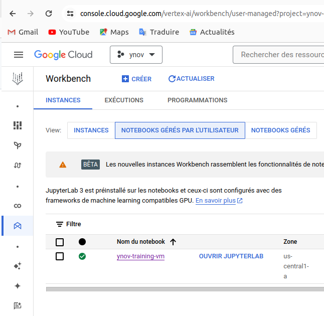
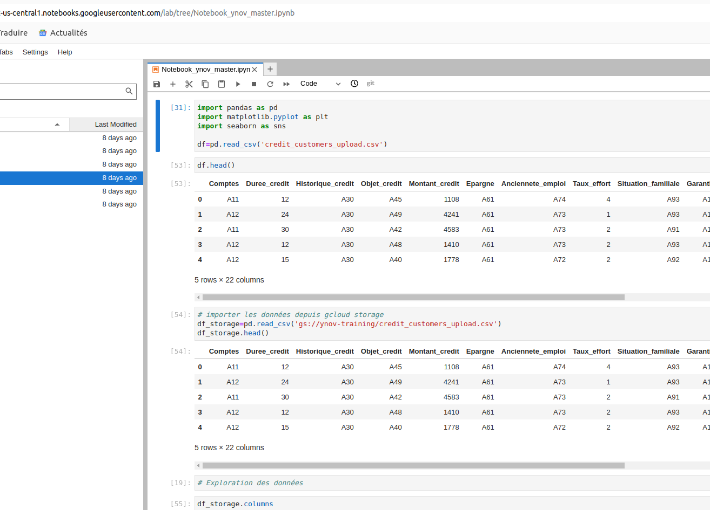

# Modèle de prédiction du risque de remboursement de crédit bancaire

Ce projet vise à développer un modèle de machine learning pour prédire le risque de remboursement de crédit bancaire, permettant ainsi aux institutions financières de prendre des décisions plus éclairées en matière de prêts.

## Objectifs

- Construire un modèle de prédiction du risque de remboursement de crédit en utilisant des techniques de machine learning.
- Classifier les clients en fonction de leur probabilité de rembourser leur crédit.
- Utiliser Google Cloud Platform (GCP) pour l'entraînement et le déploiement (En cours) du modèle

## Technologies utilisées

- **Langage de programmation** : Python
- **Librairies ML** : scikit-learn
- **Plateforme Cloud** : Google Cloud Platform (GCP)
- **Outils de développement** : Jupyter Lab
- **Gestion de versions** : Git

## Structure du projet

```
|- data/                    # Répertoire pour les données
|   |- credit_data.csv      # Fichier CSV contenant les données du crédit
|- notebooks/               # Répertoire pour les notebooks Jupyter
|   |- Credit_Risk_Prediction.ipynb    # Notebook contenant l'analyse des données et la construction du modèle
|- models/                  # Répertoire pour sauvegarder les modèles entraînés
|- screenshots/             # Répertoire pour les captures d'écran
|   |- GCP_Workbench.png    # Capture d'écran de l'interface Workbench sur GCP
|   |- JupyterLab_GCP.png   # Capture d'écran du notebook dans Jupyter Lab sur GCP
|- overview_models_results/ # Répertoire pour les résultats de modèle
|   |- iteration_0.webcam   # Vidéo de l'itération 0 du modèle
|   |- iteration_1.webcam   # Vidéo de l'itération 1 du modèle
|   |- iteration_2.webcam   # Vidéo de l'itération 2 du modèle
|- Scripts/                 # Répertoire pour les scripts Python
|   |- main.py              # Script principal
|   |- exploration.py       # Script pour l'exploration des données
|   |- visualization.py     # Script pour la visualisation des données
|   |- preprocessing.py     # Script pour le prétraitement des données
|   |- train_evaluate.py    # Script pour l'entraînement et l'évaluation des modèles
```

## Instructions d'utilisation

1. **Installation des dépendances** :

   Assurez-vous d'avoir installé toutes les dépendances nécessaires répertoriées dans le fichier `requirements.txt`. Vous pouvez les installer en exécutant la commande suivante :
   ```
   pip install -r requirements.txt
   ```

2. **Exécution des scripts** :

   Exécutez les scripts Python dans le répertoire `Scripts/` pour effectuer diverses tâches telles que l'exploration des données, la visualisation, le prétraitement et l'entraînement des modèles.

3. **Déploiement sur GCP** :

   Utilisez l'interface Workbench de GCP pour charger les données, entraîner le modèle et le déployer en production. Référez-vous à la documentation de GCP pour plus de détails sur ces étapes.

## Captures d'écran

- **Interface Workbench sur GCP** :
  

- **Notebook dans Jupyter Lab sur GCP** :
  

- **Vidéo YouTube** :
  [Lien vers la vidéo](https://youtu.be/IpkuGQDhuMY)

## Problèmes rencontrés et solutions envisagées

J'ai rencontré des difficultés lors de la gestion des hyperparamètres des modèles à chaque itération, ce qui a rendu difficile la sauvegarde des meilleurs hyperparamètres. Pour résoudre ce problème, j'ai décidé d'organiser les résultats des modèles dans les répertoires `overview_models_results/` et `models/`. Cependant, cela peut être fastidieux à long terme.

La prochaine étape consistera à travailler sur un projet de clustering pour explorer davantage d'autres types de données et utiliser un outil de suivi des expériences tel que MLFlow, qui facilitera la gestion des hyperparamètres et la sauvegarde des modèles. De plus, je prévois de déployer le modèle entraîné en utilisant FlaskAPI et de créer une interface utilisateur conviviale avec Streamlit.